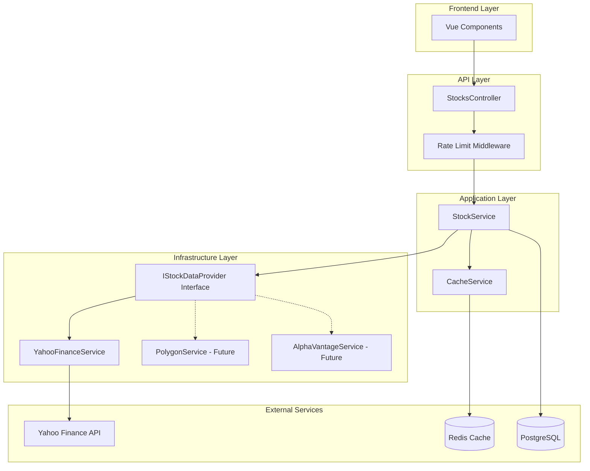
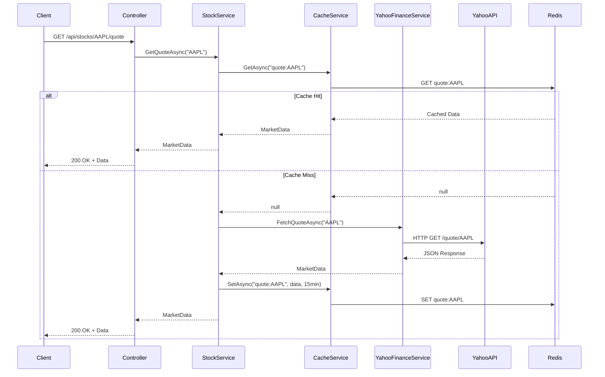

# Design Document - Yahoo Finance Integration

## Overview

This design document outlines the architecture and implementation approach for integrating Yahoo Finance API into StockSense Pro. The integration provides a robust, scalable, and maintainable data layer that serves as the foundation for all market data operations, AI agent analysis, and trading signals.

The design follows SOLID principles, implements the Adapter pattern for flexibility, and includes comprehensive caching, error handling, and rate limiting strategies.

## Architecture

### High-Level Architecture



### Component Interaction Flow



## Components and Interfaces

### 1. IStockDataProvider Interface

Defines the contract for all stock data providers, enabling the Adapter pattern.

```csharp
public interface IStockDataProvider
{
    // Market Data
    Task<MarketData> GetQuoteAsync(string symbol, CancellationToken cancellationToken = default);
    Task<List<MarketData>> GetQuotesAsync(List<string> symbols, CancellationToken cancellationToken = default);
    
    // Historical Data
    Task<List<HistoricalPrice>> GetHistoricalPricesAsync(
        string symbol, 
        DateTime startDate, 
        DateTime endDate, 
        TimeInterval interval = TimeInterval.Daily,
        CancellationToken cancellationToken = default);
    
    // Fundamental Data
    Task<FundamentalData> GetFundamentalsAsync(string symbol, CancellationToken cancellationToken = default);
    
    // Company Information
    Task<CompanyProfile> GetCompanyProfileAsync(string symbol, CancellationToken cancellationToken = default);
    
    // Search
    Task<List<StockSearchResult>> SearchSymbolsAsync(string query, int limit = 10, CancellationToken cancellationToken = default);
    
    // Health Check
    Task<bool> IsHealthyAsync(CancellationToken cancellationToken = default);
}
```

### 2. YahooFinanceService Implementation

Concrete implementation using Yahoo Finance API (via yfinance Python library or direct REST calls).

**Key Responsibilities:**
- Fetch data from Yahoo Finance API
- Transform Yahoo-specific responses to standardized models
- Handle API-specific errors and rate limits
- Implement retry logic with exponential backoff
- Log all operations for monitoring

**Implementation Strategy:**
- Use HttpClient with Polly for resilience (retry, circuit breaker, timeout)
- Implement request/response logging
- Use structured exception handling
- Support both synchronous and asynchronous operations

### 3. StockService (Application Layer)

Orchestrates data fetching with caching and business logic.

**Key Responsibilities:**
- Check cache before calling data provider
- Coordinate multiple data sources if needed
- Apply business rules and validation
- Store frequently accessed data in database
- Manage cache invalidation strategies

### 4. CacheService (Redis Integration)

Manages all caching operations with intelligent TTL strategies.

**Cache Key Strategy:**
```
quote:{symbol}              -> TTL: 15 minutes
historical:{symbol}:{start}:{end}:{interval} -> TTL: 24 hours
fundamentals:{symbol}       -> TTL: 6 hours
profile:{symbol}            -> TTL: 7 days
search:{query}              -> TTL: 1 hour
```

**Features:**
- Automatic cache warming for popular symbols
- Cache statistics and monitoring
- Distributed caching support
- Cache invalidation on demand

### 5. Rate Limiter Middleware

Prevents exceeding API quotas and implements fair usage.

**Strategy:**
- Token bucket algorithm for rate limiting
- Per-user and global rate limits
- Configurable limits per endpoint
- Queue requests when approaching limits
- Return 429 (Too Many Requests) when exceeded

## Data Models

### MarketData

```csharp
public class MarketData
{
    public string Symbol { get; set; }
    public decimal CurrentPrice { get; set; }
    public decimal Change { get; set; }
    public decimal ChangePercent { get; set; }
    public long Volume { get; set; }
    public decimal? BidPrice { get; set; }
    public decimal? AskPrice { get; set; }
    public decimal DayHigh { get; set; }
    public decimal DayLow { get; set; }
    public decimal? FiftyTwoWeekHigh { get; set; }
    public decimal? FiftyTwoWeekLow { get; set; }
    public long? AverageVolume { get; set; }
    public long? MarketCap { get; set; }
    public DateTime Timestamp { get; set; }
    public string Exchange { get; set; }
    public MarketState MarketState { get; set; } // Open, Closed, PreMarket, AfterHours
}
```

### HistoricalPrice

```csharp
public class HistoricalPrice
{
    public string Symbol { get; set; }
    public DateTime Date { get; set; }
    public decimal Open { get; set; }
    public decimal High { get; set; }
    public decimal Low { get; set; }
    public decimal Close { get; set; }
    public decimal AdjustedClose { get; set; }
    public long Volume { get; set; }
}
```

### FundamentalData

```csharp
public class FundamentalData
{
    public string Symbol { get; set; }
    
    // Valuation Ratios
    public decimal? PERatio { get; set; }
    public decimal? PEGRatio { get; set; }
    public decimal? PriceToBook { get; set; }
    public decimal? PriceToSales { get; set; }
    public decimal? EnterpriseValue { get; set; }
    public decimal? EVToEBITDA { get; set; }
    
    // Profitability Metrics
    public decimal? ProfitMargin { get; set; }
    public decimal? OperatingMargin { get; set; }
    public decimal? ReturnOnEquity { get; set; }
    public decimal? ReturnOnAssets { get; set; }
    
    // Growth Metrics
    public decimal? RevenueGrowth { get; set; }
    public decimal? EarningsGrowth { get; set; }
    public decimal? EPS { get; set; }
    
    // Dividend Information
    public decimal? DividendYield { get; set; }
    public decimal? PayoutRatio { get; set; }
    
    // Financial Health
    public decimal? CurrentRatio { get; set; }
    public decimal? DebtToEquity { get; set; }
    public decimal? QuickRatio { get; set; }
    
    public DateTime LastUpdated { get; set; }
}
```

### CompanyProfile

```csharp
public class CompanyProfile
{
    public string Symbol { get; set; }
    public string CompanyName { get; set; }
    public string Sector { get; set; }
    public string Industry { get; set; }
    public string Description { get; set; }
    public string Website { get; set; }
    public string Country { get; set; }
    public string City { get; set; }
    public int? EmployeeCount { get; set; }
    public string CEO { get; set; }
    public DateTime? FoundedYear { get; set; }
    public string Exchange { get; set; }
    public string Currency { get; set; }
}
```

### StockSearchResult

```csharp
public class StockSearchResult
{
    public string Symbol { get; set; }
    public string Name { get; set; }
    public string Exchange { get; set; }
    public string AssetType { get; set; } // Stock, ETF, Index, etc.
    public string Region { get; set; }
    public decimal? MatchScore { get; set; }
}
```

## Error Handling

### Error Hierarchy

```csharp
public class StockDataException : Exception
{
    public string Symbol { get; set; }
    public ErrorCode Code { get; set; }
}

public class SymbolNotFoundException : StockDataException { }
public class RateLimitExceededException : StockDataException { }
public class ApiUnavailableException : StockDataException { }
public class InvalidDateRangeException : StockDataException { }
```

### Error Handling Strategy

1. **API Errors**: Retry with exponential backoff (3 attempts)
2. **Rate Limits**: Return cached data or queue request
3. **Invalid Symbols**: Return 404 with clear message
4. **Network Errors**: Implement circuit breaker pattern
5. **Timeout Errors**: Use cached data as fallback

### Circuit Breaker Configuration

```csharp
services.AddHttpClient<IYahooFinanceService, YahooFinanceService>()
    .AddPolicyHandler(GetRetryPolicy())
    .AddPolicyHandler(GetCircuitBreakerPolicy())
    .AddPolicyHandler(GetTimeoutPolicy());

static IAsyncPolicy<HttpResponseMessage> GetRetryPolicy()
{
    return HttpPolicyExtensions
        .HandleTransientHttpError()
        .WaitAndRetryAsync(3, retryAttempt => 
            TimeSpan.FromSeconds(Math.Pow(2, retryAttempt)));
}

static IAsyncPolicy<HttpResponseMessage> GetCircuitBreakerPolicy()
{
    return HttpPolicyExtensions
        .HandleTransientHttpError()
        .CircuitBreakerAsync(5, TimeSpan.FromSeconds(30));
}

static IAsyncPolicy<HttpResponseMessage> GetTimeoutPolicy()
{
    return Policy.TimeoutAsync<HttpResponseMessage>(10);
}
```

## Testing Strategy

### Unit Tests

1. **YahooFinanceService Tests**
   - Test data transformation from Yahoo format to internal models
   - Test error handling for various API responses
   - Test retry logic
   - Mock HttpClient responses

2. **StockService Tests**
   - Test caching logic
   - Test fallback to cache on API failure
   - Test business rule validation

3. **CacheService Tests**
   - Test cache key generation
   - Test TTL strategies
   - Test cache eviction

### Integration Tests

1. **End-to-End API Tests**
   - Test full flow from controller to Yahoo API
   - Test with real Redis instance
   - Test rate limiting behavior

2. **Performance Tests**
   - Test response times with and without cache
   - Test concurrent request handling
   - Test cache warming effectiveness

### Test Data

Use recorded API responses for consistent testing:
```csharp
public class YahooFinanceTestData
{
    public static string GetSampleQuoteResponse() => @"{
        ""symbol"": ""AAPL"",
        ""regularMarketPrice"": 150.25,
        ""regularMarketChange"": 2.50,
        ...
    }";
}
```

## Performance Considerations

### Optimization Strategies

1. **Batch Requests**: Fetch multiple symbols in single API call when possible
2. **Parallel Processing**: Use Task.WhenAll for independent operations
3. **Connection Pooling**: Configure HttpClient for connection reuse
4. **Compression**: Enable gzip compression for API responses
5. **Cache Warming**: Pre-fetch popular symbols during off-peak hours

### Performance Targets

- Quote retrieval: < 200ms (cached), < 2s (uncached)
- Historical data: < 500ms (cached), < 5s (uncached)
- Search: < 100ms (cached), < 1s (uncached)
- Cache hit rate: > 80% during market hours

## Security Considerations

1. **API Key Management**: Store Yahoo Finance credentials in Azure Key Vault or environment variables
2. **Input Validation**: Sanitize all user inputs to prevent injection attacks
3. **Rate Limiting**: Prevent abuse and protect API quotas
4. **Logging**: Avoid logging sensitive data (API keys, user PII)
5. **HTTPS Only**: All external API calls must use HTTPS

## Monitoring and Observability

### Metrics to Track

1. **API Performance**
   - Request count per endpoint
   - Average response time
   - Error rate
   - Rate limit hits

2. **Cache Performance**
   - Hit rate percentage
   - Miss rate percentage
   - Eviction count
   - Memory usage

3. **Business Metrics**
   - Most requested symbols
   - Peak usage times
   - User engagement patterns

### Logging Strategy

```csharp
_logger.LogInformation(
    "Fetching quote for {Symbol}. Cache: {CacheStatus}",
    symbol,
    cacheHit ? "HIT" : "MISS"
);

_logger.LogWarning(
    "Rate limit approaching for Yahoo Finance API. Current usage: {Usage}/{Limit}",
    currentUsage,
    rateLimit
);

_logger.LogError(
    exception,
    "Failed to fetch data for {Symbol} after {Attempts} attempts",
    symbol,
    retryCount
);
```

## Configuration

### appsettings.json

```json
{
  "YahooFinance": {
    "BaseUrl": "https://query2.finance.yahoo.com",
    "Timeout": 10,
    "MaxRetries": 3,
    "RateLimit": {
      "RequestsPerMinute": 100,
      "RequestsPerHour": 2000
    }
  },
  "Cache": {
    "DefaultTTL": 900,
    "QuoteTTL": 900,
    "HistoricalTTL": 86400,
    "FundamentalsTTL": 21600,
    "ProfileTTL": 604800,
    "SearchTTL": 3600
  }
}
```

## Deployment Considerations

1. **Environment Variables**: Configure API endpoints per environment (dev, staging, prod)
2. **Health Checks**: Implement /health endpoint that checks Yahoo API connectivity
3. **Graceful Degradation**: Application should function with cached data if API is down
4. **Monitoring Alerts**: Set up alerts for high error rates or API downtime
5. **Documentation**: Generate Swagger/OpenAPI docs for all endpoints

## Future Enhancements

1. **Multiple Data Providers**: Add Polygon.io and Alpha Vantage as alternative sources
2. **WebSocket Support**: Real-time streaming data for live quotes
3. **Data Aggregation**: Combine data from multiple sources for better coverage
4. **Machine Learning**: Predict optimal cache TTL based on usage patterns
5. **GraphQL API**: Provide flexible data querying for frontend
