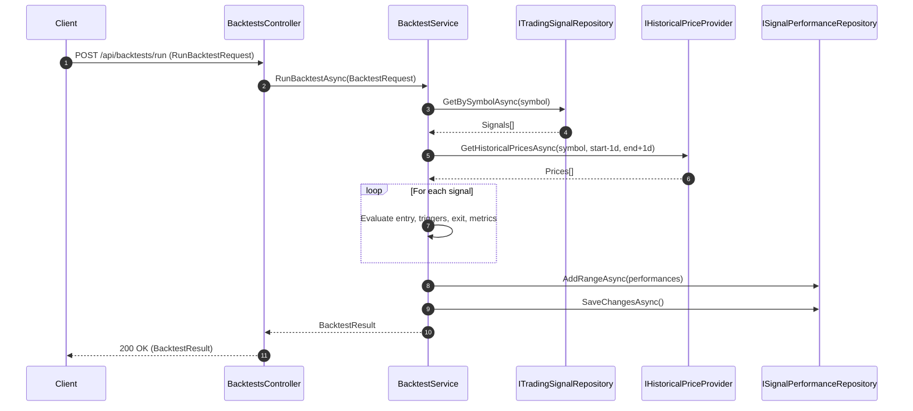
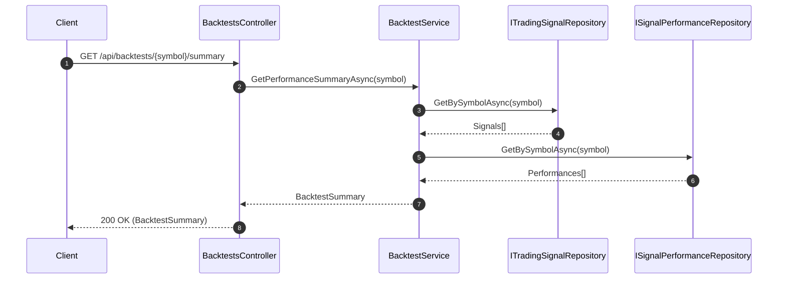
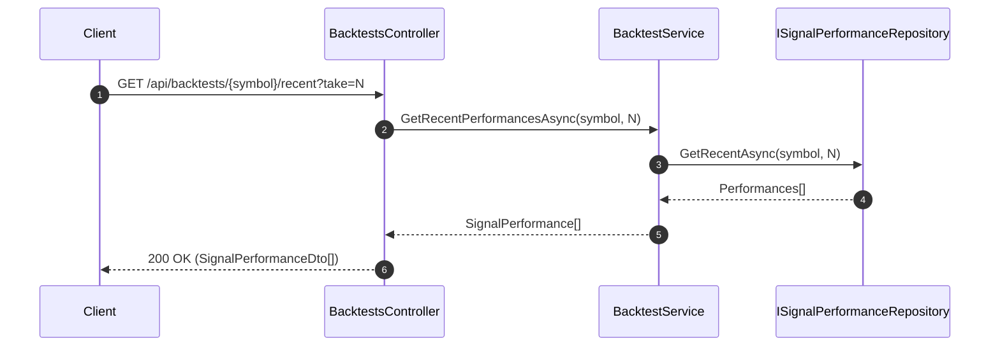

# Backtesting Engine

This document details the Backtesting Engine used by StockSense Pro: purpose, features, architecture, data flow, API, models, configuration, limitations, testing, and roadmap. It reflects the current Phase 3 focus on developing the backtesting capability first.

---

## 1) Purpose and Goals

- Provide a deterministic framework to evaluate trading signals against historical price data.
- Produce trade-level outcomes and aggregated performance metrics to validate and iterate on strategies and AI-generated signals.
- Power UI dashboards and success metrics (e.g., win rate/"signal accuracy").

---

## 2) Where It Lives (Key Files)

- Application service (core): `backend/src/StockSensePro.Application/Services/BacktestService.cs`
- API surface: `backend/src/StockSensePro.API/Controllers/BacktestsController.cs`
- Application models:
  - `backend/src/StockSensePro.Application/Models/BacktestRequest.cs`
  - `backend/src/StockSensePro.Application/Models/BacktestResult.cs`
  - `backend/src/StockSensePro.Application/Models/BacktestSummary.cs`
- API DTOs/mappers: `backend/src/StockSensePro.API/Models/BacktestModels.cs`
- Repositories (EF Core):
  - `backend/src/StockSensePro.Infrastructure/Data/Repositories/TradingSignalRepository.cs`
  - `backend/src/StockSensePro.Infrastructure/Data/Repositories/SignalPerformanceRepository.cs`
- Price provider:
  - `backend/src/StockSensePro.Infrastructure/Services/HistoricalPriceProvider.cs`
  - `backend/src/StockSensePro.Infrastructure/Services/YahooFinanceService.cs`
- DI wiring: `backend/src/StockSensePro.API/Program.cs`

---

## 3) Features

- Per-signal backtesting:
  - Holding period exits.
  - Optional stop-loss and take-profit triggers.
- Trade analytics:
  - Percent return per trade.
  - Max drawdown over the evaluation window.
  - Days held, profitability flag, exit notes.
- Aggregate metrics:
  - Total trades, winning/losing counts.
  - Average return, cumulative return (sum of % returns; not compounded).
  - Max drawdown (max of per-trade drawdowns).
- Persistence:
  - Writes `SignalPerformance` rows for historical record and dashboard queries.
- APIs to run backtests and fetch summary/recent results.

---

## 4) Architecture Overview

- Application Layer
  - `BacktestService` orchestrates backtest runs:
    - Signals via `ITradingSignalRepository`.
    - Prices via `IHistoricalPriceProvider`.
    - Writes `SignalPerformance` via `ISignalPerformanceRepository`.
- Infrastructure Layer
  - EF Core repos: `TradingSignalRepository`, `SignalPerformanceRepository`.
  - Historical prices via `IYahooFinanceService` (Yahoo Chart API v8).
- API Layer
  - `BacktestsController` exposes `run`, `summary`, `recent`, and `dashboard` endpoints.
- Serialization
  - JSON camelCase configured in `Program.cs`.

---

## 5) Data Flow (Backtest Run)

1. Client calls `POST /api/backtests/run` with parameters.
2. `BacktestsController` maps the DTO (`RunBacktestRequest`) to `BacktestRequest`.
3. `BacktestService.RunBacktestAsync`:
   - Loads signals for the symbol within `[startDate, endDate]`.
   - Loads EOD prices slightly beyond the window for safe bounds.
   - For each signal:
     - Entry = first price on/after `signal.GeneratedAt.Date`.
     - Exit:
       - If take-profit or stop-loss is reached (evaluated EOD using closes), exit at first trigger; else exit at end of holding period window.
     - Compute trade return, max drawdown, holding days, profitability.
     - Persist `SignalPerformance` with computed metrics.
   - Aggregate results to form `BacktestResult`.
4. Controller returns `BacktestResult`.

---

### Business Logic Details

This section specifies the core trading/business rules implemented in the backtester. It complements the high-level flow above and documents the semantics of parameters and calculations.

- Symbol normalization
  - Symbols are normalized to uppercase early in processing to ensure consistent repository queries and API payloads.

- Signal selection
  - Signals are fetched by symbol (normalized) and filtered into the requested `[startDate, endDate]` range.
  - If no signals are present in the range, the run returns early with an empty `BacktestResult`.

- Price range and granularity
  - Historical prices are requested slightly beyond the requested test window (typically `startDate - 1 day` and `endDate + 1 day`) to guard against bar alignment issues.
  - Prices are EOD daily bars (close-based logic). Intraday high/low are not currently used for triggering exits.

- Entry price determination
  - For each signal, the entry bar is the first available price on or after `signal.GeneratedAt.Date`.
  - If no price exists on/after the signal date within the window, the trade is skipped with a warning logged.

- Evaluation window and planned exit date
  - The holding period is `holdingPeriodDays` (minimum 1).
  - `plannedExitDate = min(signal.GeneratedAt.Date + holdingPeriodDays, request.EndDate.Date)`.
  - The evaluation set is all price bars where `bar.Date ∈ [entryDate, plannedExitDate]`, ordered ascending.

- Exit rules (stop-loss / take-profit precedence)
  - For each bar after entry (i.e., skipping the entry bar), compute `changePercent = (bar.Close - entry.Close) / entry.Close * 100`.
  - If `takeProfitPercent` is provided and `changePercent >= takeProfitPercent`, exit at this bar.
  - If `stopLossPercent` is provided and `changePercent <= -abs(stopLossPercent)`, exit at this bar.
  - If neither condition is hit by the last bar in the evaluation window, exit at the last bar (holding period exit).
  - Notes:
    - Thresholds are absolute percentages; `stopLossPercent` is treated as a positive number and applied as a negative threshold internally.
    - Triggers are evaluated using close-to-close changes (EOD), not intraday highs/lows.

- Return calculation
  - `Return% = ((exit.Close - entry.Close) / entry.Close) * 100`.
  - A trade is considered profitable if `Return% >= 0`.
  - `CumulativeReturn` in the rollup is computed as the sum of trade returns (non-compounded).

- Max drawdown (per trade)
  - Computed over the evaluation prices for the trade relative to the entry.
  - Conceptually: track the running peak of close prices after entry; the drawdown at each bar is `(currentClose - peakClose) / peakClose * 100`; max drawdown is the minimum (most negative) value across the window (reported as a positive magnitude in the UI if desired).
  - Stored per-trade as `SignalPerformance.MaxDrawdown`; rollup uses the maximum observed drawdown across trades.

- Days held
  - `DaysHeld = max(1, (ExitDate.Date - EntryDate.Date).TotalDays)` to avoid 0-day trades when entry and exit occur on the same trading day.

- Aggregation and summary
  - `TotalTrades = count(trades)`.
  - `WinningTrades = count(trades where Return% >= 0)`; `LosingTrades = TotalTrades - WinningTrades`.
  - `AverageReturn = mean(Return%)` across trades.
  - `CumulativeReturn = sum(Return%)`.
  - `MaxDrawdown = max(per-trade MaxDrawdown)`.
  - `WinRate` (in `BacktestSummary`) = `WinningTrades / EvaluatedSignals * 100`.

- Persistence semantics
  - For each evaluated trade, a `SignalPerformance` record is written containing: `TradingSignalId`, `EvaluatedAt` (UTC now), `ActualReturn`, `BenchmarkReturn` (currently 0), `WasProfitable`, `DaysHeld`, `EntryPrice`, `ExitPrice`, `MaxDrawdown`, `Notes`.
  - `GetRecentPerformancesAsync` and `GetPerformanceSummaryAsync` query these records for dashboards and summaries.

- Validation and edge cases
  - If `symbol` is empty or `startDate >= endDate`, an error is raised.
  - If no evaluation prices exist for a signal’s entry-to-exit window, the trade is skipped with a warning.
  - Division by zero is guarded by checking `entry.Close == 0` (in which case return is treated as 0 and the trade may be skipped depending on policy).
  - Overlapping signals are evaluated independently; portfolio-level constraints (e.g., single position at a time) are not enforced.

---

### Worked Examples

These examples illustrate how the business rules are applied by `BacktestService` (notably `EvaluateExitPrice(...)` and run aggregation logic).

- Example A — Take-profit triggers (EOD closes)
  - Inputs: entry close = 100.00; `takeProfitPercent = 8%`; `stopLossPercent = 5%`; `holdingPeriodDays = 5`.
  - Price path (EOD closes): Day0=100.00 (entry), Day1=103.00, Day2=108.00, Day3=107.00.
  - Day2 change from entry = (108-100)/100*100 = 8% ⇒ take-profit triggers.
  - Exit at Day2 close 108.00.
  - Return% = (108-100)/100*100 = +8.00%.
  - Notes = "Exited via stop/target trigger".

- Example B — Stop-loss triggers (EOD closes)
  - Inputs: entry close = 100.00; `stopLossPercent = 5%`; `takeProfitPercent = 10%`; `holdingPeriodDays = 5`.
  - Price path: Day0=100.00 (entry), Day1=98.00, Day2=94.00.
  - Day1 change = -2% (no trigger); Day2 change = -6% ≤ -5% ⇒ stop-loss triggers.
  - Exit at Day2 close 94.00.
  - Return% = (94-100)/100*100 = -6.00%.

- Example C — No triggers; exit at holding period end
  - Inputs: entry close = 100.00; `stopLossPercent = null`; `takeProfitPercent = null`; `holdingPeriodDays = 4`.
  - Price path: Day0=100.00 (entry), Day1=101.00, Day2=99.00, Day3=102.00, Day4=101.00.
  - With no triggers, exit at last bar in window (Day4).
  - Return% = (101-100)/100*100 = +1.00%.

- Example D — Max drawdown (per trade) step-by-step
  - Entry close = 100.00; closes: [100.00 (entry), 104.00, 103.00, 106.00, 101.00].
  - Running peak after entry: [100.00, 104.00, 104.00, 106.00, 106.00].
  - Drawdowns each bar (as % of running peak):
    - Entry: 0.00%
    - 104.00: (104-104)/104 = 0.00%
    - 103.00: (103-104)/104 ≈ -0.96%
    - 106.00: (106-106)/106 = 0.00%
    - 101.00: (101-106)/106 ≈ -4.72%
  - Max drawdown magnitude = 4.72% (stored as positive magnitude in UI if desired; code stores numeric value via `SignalPerformance.MaxDrawdown`).

- Example E — Additive vs compounded returns
  - Three trades with returns: +10%, -5%, +7%.
  - Additive cumulative (current implementation): 10 - 5 + 7 = +12%.
  - Compounded on 1.0 capital: 1.00×1.10×0.95×1.07 = 1.11715 ⇒ +11.715%.
  - Difference is small in this case, but compounding can diverge; roadmap includes optional compounded metrics and equity curve.

- Example F — Days held edge case
  - Entry date = 2025-05-01; exit date = 2025-05-01 (same day due to trigger).
  - `DaysHeld = max(1, (ExitDate.Date - EntryDate.Date).TotalDays)` ⇒ 1.

---

### Parameter Tuning Guide

This guide summarizes how `stopLossPercent`, `takeProfitPercent`, and `holdingPeriodDays` typically affect outcomes and how to choose reasonable values.

- Stop-loss percent (risk control)
  - Tighter stops (smaller %) reduce average loss size and tail risk but can prematurely exit winning trades due to noise.
  - Wider stops (larger %) allow trades room to breathe but increase average drawdown and loss size.
  - Suggested starting range: 3–10% for EOD equity strategies; tune per symbol volatility (e.g., use ATR-multiple in future iterations).

- Take-profit percent (reward capture)
  - Lower targets lock in frequent small gains but may cap upside; can increase win rate while lowering average return per winner.
  - Higher targets capture big moves but reduce hit rate; increases variance of returns.
  - Suggested starting range: 5–20% for EOD equities; consider asymmetric SL/TP (e.g., 5% SL / 10% TP) for positive skew.

- Holding period (time stop)
  - Shorter windows emphasize momentum bursts; fewer bars for triggers to fire; reduces exposure and overnight risk.
  - Longer windows allow mean-reversion or trend continuation; increases exposure and drawdown risk.
  - Suggested starting range: 3–10 trading days for momentum; 10–20 days for swing/mean reversion.

- Interactions and trade-offs
  - SL vs TP: Tight SL with high TP can produce low hit rate but high payoff ratio; the inverse increases hit rate but lowers payoff.
  - Holding period vs triggers: If triggers rarely fire within the holding window, exits will default to time-based, effectively shaping a time-stop strategy.
  - Volatility sensitivity: Stable large caps tolerate tighter SL/TP; high-beta names may need wider bands.

- Practical tuning approach
  - Start with a baseline (e.g., SL=5%, TP=10%, HP=5 days) per symbol or sector.
  - Perform a coarse grid search across small sets (e.g., SL=[3,5,7], TP=[8,10,15], HP=[3,5,7]).
  - Evaluate on out-of-sample periods to avoid overfitting; prefer robust configurations that generalize.
  - Track metrics: win rate, avg return, max drawdown, and distribution of returns (not just means).
  - Consider adaptive rules in future (ATR-based SL/TP, trailing stops) once baseline is validated.

---

### Sequence Diagrams (Service/Repository Interactions)

The following sequence diagrams illustrate how the API, application services, repositories, and providers interact during typical operations.

- Run Backtest



- Get Summary



- Get Recent Performances



---

## 6) API Reference

Base: `https://localhost:5565/api`

### 6.1 POST /backtests/run

Runs a backtest for a symbol in a given date range and parameters.

Request body (JSON):
```json
{
  "symbol": "AAPL",
  "startDate": "2025-01-01T00:00:00Z",
  "endDate": "2025-06-01T00:00:00Z",
  "holdingPeriodDays": 5,
  "stopLossPercent": 5.0,
  "takeProfitPercent": 10.0,
  "strategy": "default"
}
```

Response: `BacktestResult`
- Contains `trades` array plus totals/averages/drawdown rollups.

### 6.2 GET /backtests/{symbol}/summary

Returns `BacktestSummary` for a symbol:
```json
{
  "symbol": "AAPL",
  "totalSignals": 123,
  "evaluatedSignals": 90,
  "averageReturn": 2.34,
  "cumulativeReturn": 210.5,
  "winRate": 65.55,
  "maxDrawdown": 12.2,
  "lastEvaluatedAt": "2025-11-10T14:22:01Z"
}
```

### 6.3 GET /backtests/{symbol}/recent?take=20

Returns the `take` most recent `SignalPerformanceDto` items.

### 6.4 GET /backtests/{symbol}/dashboard?recent=10

Returns both `summary` and the recent performances list in one payload.

---

## 7) Models (Essentials)

- `BacktestRequest` (Application)
  - `symbol`, `startDate`, `endDate`, `holdingPeriodDays`, `stopLossPercent?`, `takeProfitPercent?`, `strategy`
- `BacktestResult` (Application)
  - `trades: BacktestTradeResult[]`, totals, average return, cumulative return, max drawdown
- `BacktestSummary` (Application)
  - Summary stats across stored performances for a symbol
- `SignalPerformance` (Core Entity)
  - `TradingSignalId`, `EvaluatedAt`, `ActualReturn`, `BenchmarkReturn` (currently 0), `WasProfitable`, `DaysHeld`, `EntryPrice`, `ExitPrice`, `MaxDrawdown`, `Notes`
- API DTOs
  - `RunBacktestRequest`, `SignalPerformanceDto`, `BacktestPerformanceResponse`

---

## 8) Configuration & Dependencies

- Database: PostgreSQL (via EF Core)
- Cache: Redis available (`RedisCacheService`), not yet used by backtests
- Historical Prices: Yahoo Chart API via `IYahooFinanceService`
- JSON: camelCase in `Program.cs`

---

## 9) Assumptions & Current Limitations

- Strategy handling
  - The `strategy` parameter is present but not yet used for alternate logic.
- Position side
  - Current implementation assumes long entries; explicit short/SELL logic is not implemented yet.
- Trigger realism
  - Stop-loss and take-profit checks use EOD closes (no intraday high/low simulation).
- Cumulative return
  - Reported as the sum of percentage returns, not compounded.
- Benchmark
  - `BenchmarkReturn` is currently `0` (placeholder).
- Signals
  - Backtester does not generate signals; requires signals in DB for the selected range.
- Migrations
  - Dev bootstrapping uses `EnsureCreated`; production should switch to EF migrations.

---

## 10) Testing Guidance

- Unit Tests (`backend/tests/StockSensePro.UnitTests/`)
  - `BacktestService` scenarios:
    - Proper entry/exit detection over holding periods
    - Stop-loss and take-profit triggers
    - Drawdown calculation
    - Edge cases (no price data; zero entry price; start >= end validation)
- Integration Tests
  - `BacktestsController` endpoints (`/run`, `/summary`, `/recent`, `/dashboard`)
  - Validate request errors and response shapes
- Test Infra
  - Mock `IHistoricalPriceProvider` and Repos for deterministic sets

---

## 11) Roadmap

- Strategy Engine
  - Implement multiple strategies and short/SELL trade logic
- Analytics
  - Compounded returns and equity curve
  - Volatility, Sharpe/Sortino, exposure, average holding period
  - Benchmark integration (e.g., SPY)
- Trigger Realism
  - Use high/low for intraday-like stop/target checks (if supported)
- Performance & Caching
  - Cache historical prices and backtest results keyed by parameters
- Operations
  - Replace `EnsureCreated` with EF migrations and add seeders for signals

---

## 12) Quick Start

1. Start backend API (dev): `cd backend/src/StockSensePro.API && dotnet run`
2. Access Swagger: `https://localhost:5565/swagger`
3. Run backtest via POST `/api/backtests/run` (see 6.1)
4. Query summary `/api/backtests/{symbol}/summary` or dashboard `/api/backtests/{symbol}/dashboard`
5. Frontend can call `backtestService.getDashboard(symbol)` from `frontend/src/services/api.js`

---

## 13) File References (Index)

- Service: `backend/src/StockSensePro.Application/Services/BacktestService.cs`
- Controller: `backend/src/StockSensePro.API/Controllers/BacktestsController.cs`
- Models: `backend/src/StockSensePro.Application/Models/`
- API Models: `backend/src/StockSensePro.API/Models/BacktestModels.cs`
- Repositories: `backend/src/StockSensePro.Infrastructure/Data/Repositories/`
- Providers: `backend/src/StockSensePro.Infrastructure/Services/`
- DI: `backend/src/StockSensePro.API/Program.cs`

---

If you update the backtesting logic (e.g., strategy or short handling), please update this document accordingly to keep API examples and limitations in sync with the implementation.
