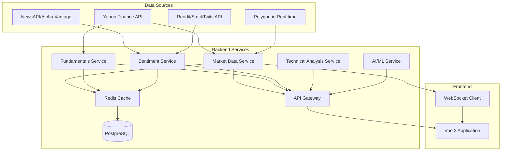

# Yahoo Finance API Capability Analysis

## Executive Summary

This document analyzes the Yahoo Finance API capabilities against the requirements of StockSense Pro and identifies data gaps with proposed solutions.

## Available Data from Yahoo Finance API

### ✅ Fully Supported Features

#### 1. Historical Market Data
- **OHLCV Data**: Open, High, Low, Close, Volume
- **Timeframes**: Intraday (1m, 5m, 15m, 30m, 1h) and daily/weekly/monthly
- **Historical Range**: Up to several years of data
- **Coverage**: Stocks, ETFs, indices, currencies, cryptocurrencies

#### 2. Fundamental Data
- **Financial Statements**:
  - Income Statement (quarterly and annual)
  - Balance Sheet (quarterly and annual)
  - Cash Flow Statement (quarterly and annual)
- **Key Metrics**:
  - P/E Ratio, EPS, Market Cap
  - Dividend Yield, Payout Ratio
  - Beta, 52-week range
  - Revenue, Profit Margins
  - Debt-to-Equity, Current Ratio
  - ROE, ROA, ROIC

#### 3. Company Information
- Business description and summary
- Sector and industry classification
- Company officers and executives
- Contact information and website
- Number of employees

#### 4. Real-time Data
- Current stock price (15-20 minute delay for free tier)
- Bid/Ask prices and sizes
- Day's trading range
- Volume (current and average)
- Market cap

#### 5. Options Data
- Options chains (calls and puts)
- Strike prices and expiration dates
- Implied volatility
- Open interest

#### 6. Index Data
- Major indices (S&P 500, NASDAQ, DOW)
- Index composition
- Real-time index values

## ⚠️ Partially Supported Features

### 1. News Data
**Available**:
- Recent news headlines and summaries
- News URLs and publication dates
- Publisher information

**Limitations**:
- Limited historical news archive
- No sentiment scores provided
- No categorization by impact level
- Quality and completeness vary

**Proposed Solution**:
```
Primary: Yahoo Finance API for basic news
Backup: Integrate NewsAPI.org or Alpha Vantage News API
- NewsAPI.org: 100 requests/day free tier
- Alpha Vantage: News & Sentiment API with sentiment scores
- Implement caching to reduce API calls
```

### 2. Analyst Ratings
**Available**:
- Current analyst recommendations (Buy/Hold/Sell)
- Target price estimates
- Number of analysts covering the stock

**Limitations**:
- Limited historical rating changes
- No detailed analyst reports
- No upgrade/downgrade notifications

**Proposed Solution**:
```
Primary: Yahoo Finance for current ratings
Enhancement: Scrape or integrate with:
- Finviz for analyst changes
- Implement webhook/polling for rating changes
- Cache historical changes in database
```

## ❌ Not Supported - Requires Alternative Solutions

### 1. Social Media Sentiment Analysis
**Gap**: Yahoo Finance does not provide social media sentiment data.

**Proposed Solution**:
```
Option A: Twitter/X API (Paid)
- Twitter API v2 with Academic/Enterprise access
- Real-time tweet streaming
- Sentiment analysis using NLP libraries

Option B: Reddit API (Free with rate limits)
- Reddit API for r/wallstreetbets, r/stocks, r/investing
- PRAW (Python Reddit API Wrapper)
- Sentiment analysis using VADER or TextBlob

Option C: StockTwits API (Free tier available)
- Financial social network focused on stocks
- Built-in sentiment indicators
- 200 requests/hour free tier

Recommended: Hybrid approach
1. Reddit API for community sentiment (free)
2. StockTwits API for trader sentiment (free)
3. Custom NLP sentiment analysis using:
   - VADER (Valuation Aware Dictionary and sEntiment Reasoner)
   - FinBERT (Financial sentiment analysis model)
   - TextBlob for general sentiment
```

### 2. Advanced Technical Indicators
**Gap**: Yahoo Finance provides raw OHLCV data but not pre-calculated technical indicators.

**Proposed Solution**:
```
Calculate indicators server-side using libraries:
- TA-Lib (Technical Analysis Library) - C# wrapper available
- Skender.Stock.Indicators (Native C# library)

Indicators to implement:
- Moving Averages (SMA, EMA, WMA)
- RSI (Relative Strength Index)
- MACD (Moving Average Convergence Divergence)
- Bollinger Bands
- Fibonacci Retracements
- Stochastic Oscillator
- ATR (Average True Range)
- Volume indicators (OBV, VWAP)
```

### 3. AI-Powered Trading Signals
**Gap**: No AI/ML-based trading signals or recommendations.

**Proposed Solution**:
```
Implement custom AI/ML pipeline:

Backend Components:
1. Feature Engineering Service
   - Technical indicators
   - Fundamental ratios
   - Sentiment scores
   - Market regime detection

2. ML Model Service
   - LSTM for price prediction
   - Random Forest for classification
   - Ensemble models for signal generation
   - Model versioning and A/B testing

3. Signal Generation Service
   - Combine multiple model outputs
   - Risk-adjusted recommendations
   - Confidence scores
   - Backtesting results

Libraries:
- ML.NET for C# (Microsoft's ML framework)
- ONNX Runtime for model deployment
- Python microservice for advanced models (optional)
```

### 4. Real-time Streaming Data
**Gap**: Yahoo Finance free tier has 15-20 minute delays.

**Proposed Solution**:
```
Option A: Polygon.io (Recommended)
- Real-time and historical data
- WebSocket streaming
- Free tier: 5 API calls/minute
- Paid tier: $29/month for real-time

Option B: Alpha Vantage
- Real-time quotes
- Free tier: 5 API calls/minute, 500/day
- Premium: $49.99/month

Option C: IEX Cloud
- Real-time market data
- Free tier available with limits
- Pay-as-you-go pricing

Recommended Approach:
- Use Yahoo Finance for historical and fundamental data (free)
- Use Polygon.io free tier for real-time quotes (5 calls/min)
- Implement intelligent caching and rate limiting
- WebSocket for real-time updates to frontend
```

### 5. Earnings Calendar with Estimates
**Gap**: Limited earnings calendar data.

**Proposed Solution**:
```
Option A: Alpha Vantage Earnings Calendar API
- Free tier available
- Earnings dates and estimates
- Historical earnings data

Option B: Earnings Whispers API
- Detailed earnings data
- Whisper numbers
- Paid service

Option C: Web Scraping (Last Resort)
- Scrape from Yahoo Finance earnings calendar page
- Implement robust error handling
- Respect rate limits and robots.txt

Recommended: Alpha Vantage + Yahoo Finance combination
```

### 6. Market Heatmaps and Sector Performance
**Gap**: No aggregated sector/industry performance data.

**Proposed Solution**:
```
Calculate from available data:
1. Fetch all stocks in each sector (Yahoo Finance)
2. Calculate weighted average performance
3. Generate heatmap data server-side
4. Cache results (update every 15-30 minutes)

Alternative:
- Finviz API for sector performance
- TradingView widgets (embedded)
```

## Implementation Architecture

### Data Flow Diagram



## API Rate Limiting Strategy

### Yahoo Finance (Unofficial)
- **Limit**: ~2,000 requests/hour (soft limit)
- **Strategy**: 
  - Cache aggressively (15-30 min for quotes, 24h for fundamentals)
  - Batch requests where possible
  - Implement exponential backoff

### NewsAPI.org
- **Free Tier**: 100 requests/day
- **Strategy**:
  - Fetch news every 2 hours
  - Cache for 6 hours
  - Prioritize high-impact stocks

### Reddit API
- **Limit**: 60 requests/minute
- **Strategy**:
  - Poll every 5 minutes
  - Focus on top posts only
  - Implement webhook if available

### Polygon.io (Free Tier)
- **Limit**: 5 API calls/minute
- **Strategy**:
  - Use for critical real-time data only
  - Implement request queue
  - WebSocket for streaming when possible

## Cost Analysis

### Free Tier Setup (Recommended for MVP)
| Service | Cost | Limitations |
|---------|------|-------------|
| Yahoo Finance | Free | 15-20 min delay, soft rate limits |
| Reddit API | Free | 60 req/min |
| StockTwits | Free | 200 req/hour |
| NewsAPI.org | Free | 100 req/day |
| Alpha Vantage | Free | 5 req/min, 500/day |
| Polygon.io | Free | 5 req/min |
| **Total** | **$0/month** | Suitable for prototype/MVP |

### Production Setup (Recommended)
| Service | Cost | Benefits |
|---------|------|----------|
| Yahoo Finance | Free | Historical + fundamentals |
| Polygon.io | $29/month | Real-time data, WebSocket |
| NewsAPI.org | $449/month | 250k requests/month |
| OpenAI API | ~$50/month | Sentiment analysis, AI features |
| **Total** | **~$528/month** | Production-ready |

## Recommendations

### Phase 1: MVP (Use Free Tier)
1. ✅ Yahoo Finance for all historical and fundamental data
2. ✅ Reddit API for social sentiment
3. ✅ Server-side technical indicator calculation
4. ✅ Basic news from Yahoo Finance
5. ✅ Cached data with 15-30 minute refresh

### Phase 2: Enhanced Features
1. ➕ Integrate NewsAPI or Alpha Vantage for better news
2. ➕ Add StockTwits for trader sentiment
3. ➕ Implement basic ML models for signals
4. ➕ Real-time updates via WebSocket

### Phase 3: Production
1. 🚀 Upgrade to Polygon.io for real-time data
2. 🚀 Advanced AI/ML models with backtesting
3. 🚀 Multi-source sentiment aggregation
4. 🚀 Custom alerts and notifications

## Conclusion

**Yahoo Finance API can provide 70-80% of required data** for StockSense Pro. The main gaps are:
- Real-time streaming (15-20 min delay)
- Social media sentiment (not available)
- Pre-calculated technical indicators (raw data only)
- Advanced news sentiment (basic news only)

All gaps can be addressed through:
1. **Free alternatives** (Reddit, StockTwits, server-side calculations)
2. **Paid upgrades** (Polygon.io, NewsAPI) for production
3. **Custom implementation** (ML models, technical indicators)

The proposed hybrid approach balances cost, functionality, and scalability.
