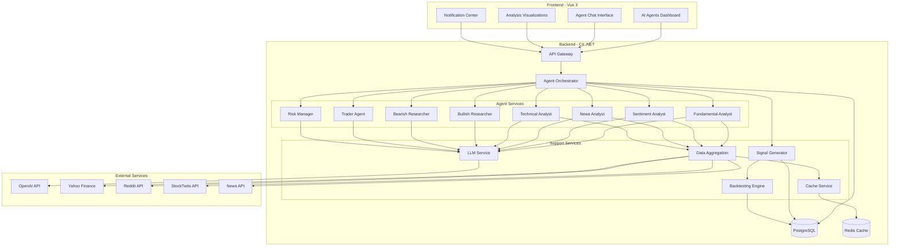
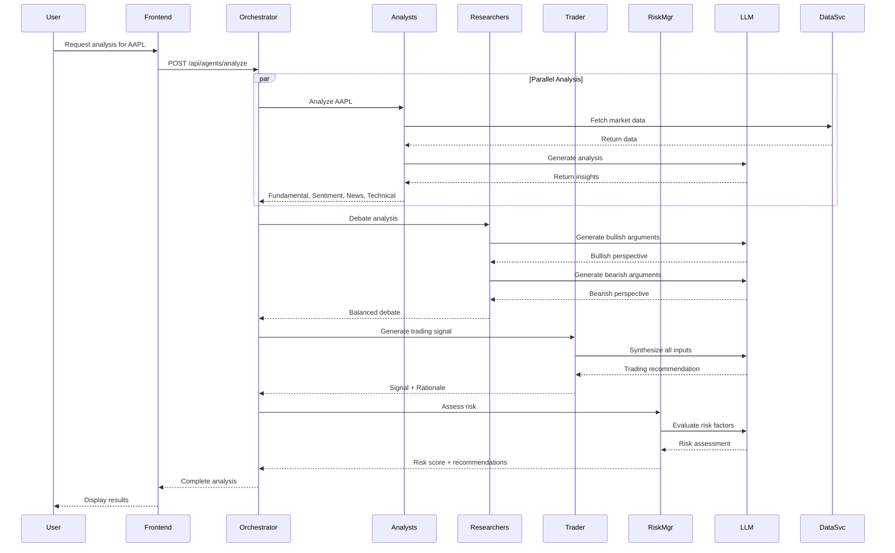
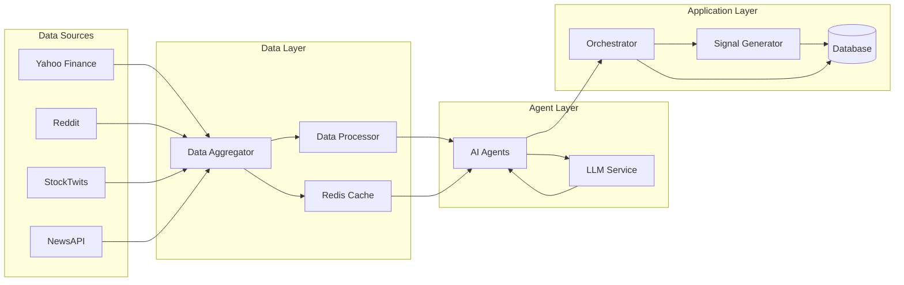
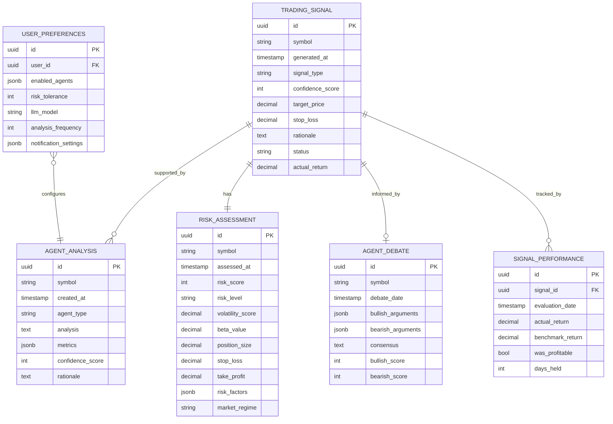
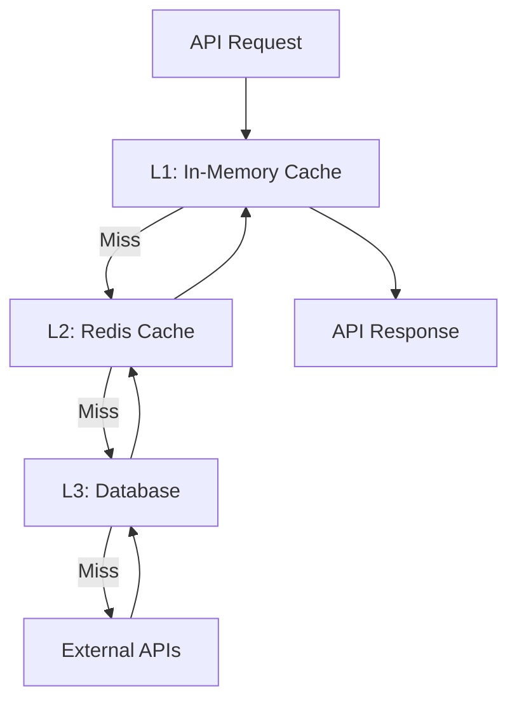
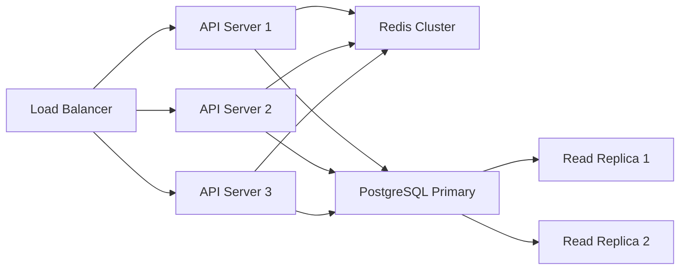
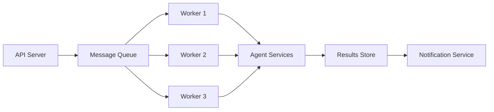
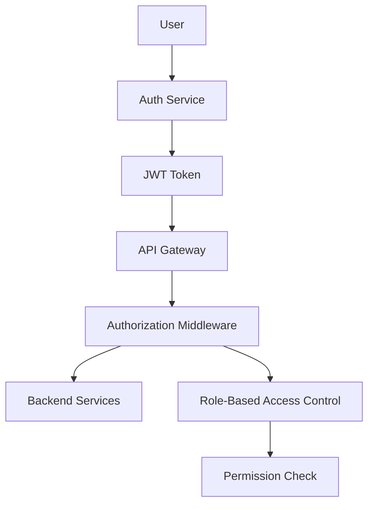
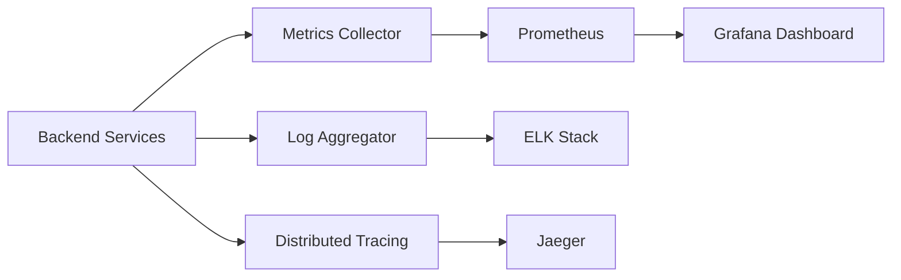
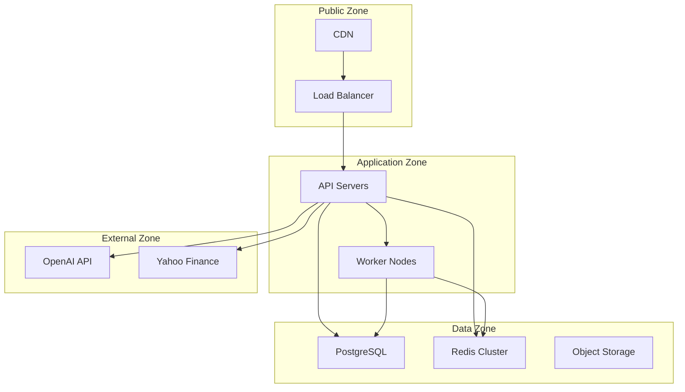

# EPIC-001: AI Trading Agents - Architecture Design

## System Architecture Overview



## Agent Workflow Sequence



## Data Flow Architecture



## Component Responsibilities

### Frontend Components

#### 1. AI Agents Dashboard
- Display comprehensive analysis results
- Show agent cards with individual analyses
- Visualize trading signals with confidence scores
- Present debate between bullish/bearish researchers
- Display risk assessment metrics

#### 2. Agent Chat Interface
- Allow users to ask follow-up questions
- Maintain conversation context
- Display agent responses in real-time
- Support multi-turn conversations

#### 3. Analysis Visualizations
- Chart components for technical analysis
- Sentiment trend graphs
- Performance metrics dashboards
- Risk assessment gauges

#### 4. Notification Center
- Real-time signal notifications via WebSocket
- Notification history and management
- User preference configuration

### Backend Services

#### 1. Agent Orchestrator
**Responsibilities**:
- Coordinate multiple agents
- Manage agent execution order
- Aggregate agent results
- Handle error recovery
- Implement retry logic

**Design Pattern**: Facade Pattern

```csharp
public class AgentOrchestrator
{
    private readonly IServiceProvider _serviceProvider;
    private readonly ILogger<AgentOrchestrator> _logger;
    
    public async Task<ComprehensiveAnalysis> AnalyzeStock(
        string symbol,
        AnalysisRequest request)
    {
        var context = new AnalysisContext(symbol);
        
        // Phase 1: Data Collection
        await CollectMarketData(context);
        
        // Phase 2: Analyst Execution (Parallel)
        await ExecuteAnalysts(context, request.EnabledAgents);
        
        // Phase 3: Researcher Debate (Sequential)
        if (request.IncludeDebate)
            await ExecuteDebate(context);
        
        // Phase 4: Signal Generation
        await GenerateSignal(context);
        
        // Phase 5: Risk Assessment
        if (request.IncludeRiskAssessment)
            await AssessRisk(context);
        
        return context.ToComprehensiveAnalysis();
    }
}
```

#### 2. LLM Service
**Responsibilities**:
- Abstract LLM provider (OpenAI, Claude, etc.)
- Manage API calls and rate limiting
- Handle prompt engineering
- Implement caching for similar queries
- Track token usage and costs

**Design Pattern**: Strategy Pattern + Adapter Pattern

```csharp
public interface ILLMProvider
{
    Task<string> GenerateCompletion(string prompt, LLMOptions options);
    Task<bool> IsAvailable();
    decimal CalculateCost(int tokens);
}

public class OpenAIProvider : ILLMProvider { }
public class ClaudeProvider : ILLMProvider { }

public class LLMService
{
    private readonly Dictionary<LLMProviderType, ILLMProvider> _providers;
    private readonly ILLMCache _cache;
    
    public async Task<string> GenerateAnalysis(
        string prompt, 
        AgentType agentType)
    {
        var cacheKey = GenerateCacheKey(prompt, agentType);
        
        // Check cache first
        var cached = await _cache.GetAsync(cacheKey);
        if (cached != null) return cached;
        
        // Select provider based on agent type
        var provider = SelectProvider(agentType);
        
        // Generate with retry logic
        var result = await ExecuteWithRetry(
            () => provider.GenerateCompletion(prompt, GetOptions(agentType))
        );
        
        // Cache result
        await _cache.SetAsync(cacheKey, result, TimeSpan.FromHours(1));
        
        return result;
    }
}
```

#### 3. Data Aggregation Service
**Responsibilities**:
- Fetch data from multiple sources
- Normalize data formats
- Implement caching strategy
- Handle API rate limits
- Provide unified data interface

**Design Pattern**: Repository Pattern + Adapter Pattern

```csharp
public interface IDataAggregationService
{
    Task<MarketData> GetMarketData(string symbol);
    Task<FundamentalData> GetFundamentals(string symbol);
    Task<SentimentData> GetSentiment(string symbol);
    Task<List<NewsArticle>> GetNews(string symbol);
}

public class DataAggregationService : IDataAggregationService
{
    private readonly IYahooFinanceAdapter _yahooAdapter;
    private readonly IRedditAdapter _redditAdapter;
    private readonly IStockTwitsAdapter _stockTwitsAdapter;
    private readonly INewsApiAdapter _newsAdapter;
    private readonly ICacheService _cache;
    
    public async Task<MarketData> GetMarketData(string symbol)
    {
        var cacheKey = $"market_data_{symbol}";
        
        return await _cache.GetOrCreateAsync(
            cacheKey,
            async () => await _yahooAdapter.GetMarketData(symbol),
            TimeSpan.FromMinutes(15)
        );
    }
}
```

#### 4. Signal Generator Service
**Responsibilities**:
- Synthesize agent analyses into trading signals
- Calculate confidence scores
- Determine target prices and stop losses
- Generate rationale for signals
- Store signals for backtesting

**Design Pattern**: Strategy Pattern

```csharp
public interface ISignalStrategy
{
    Task<TradingSignal> GenerateSignal(AnalysisContext context);
}

public class ConsensusSignalStrategy : ISignalStrategy
{
    public async Task<TradingSignal> GenerateSignal(AnalysisContext context)
    {
        // Weighted voting based on agent confidence
        var votes = context.Analyses
            .Select(a => new Vote
            {
                Signal = ParseSignal(a.Analysis),
                Weight = a.ConfidenceScore / 100.0
            });
        
        var consensus = CalculateConsensus(votes);
        
        return new TradingSignal
        {
            Symbol = context.Symbol,
            Signal = consensus.Signal,
            ConfidenceScore = consensus.Confidence,
            Rationale = GenerateRationale(context),
            TargetPrice = CalculateTargetPrice(context),
            StopLoss = CalculateStopLoss(context)
        };
    }
}
```

#### 5. Backtesting Engine
**Responsibilities**:
- Track historical signal performance
- Calculate accuracy metrics
- Compare against benchmarks
- Generate performance reports
- Identify signal patterns

**Design Pattern**: Template Method Pattern

```csharp
public abstract class BacktestStrategy
{
    public async Task<BacktestResult> RunBacktest(
        List<TradingSignal> signals,
        DateTime startDate,
        DateTime endDate)
    {
        var results = new List<TradeResult>();
        
        foreach (var signal in signals)
        {
            // Template method pattern
            var entry = await GetEntryPrice(signal);
            var exit = await GetExitPrice(signal);
            var result = CalculateReturn(entry, exit, signal);
            
            results.Add(result);
        }
        
        return AggregateResults(results);
    }
    
    protected abstract Task<decimal> GetEntryPrice(TradingSignal signal);
    protected abstract Task<decimal> GetExitPrice(TradingSignal signal);
}
```

## Database Schema



## Caching Strategy

### Cache Layers



### Cache TTL Strategy

| Data Type | TTL | Rationale |
|-----------|-----|-----------|
| Real-time quotes | 15 min | Balance freshness with API limits |
| Fundamental data | 24 hours | Changes infrequently |
| News articles | 6 hours | New articles arrive regularly |
| Social sentiment | 30 min | Fast-moving data |
| Technical indicators | 15 min | Recalculated with new prices |
| Agent analyses | 1 hour | Expensive to regenerate |
| Historical data | 7 days | Static historical data |

## Scalability Considerations

### Horizontal Scaling



### Async Processing



## Security Architecture

### Authentication & Authorization



### API Security Layers

1. **Rate Limiting**: 100 requests/minute per user
2. **API Key Validation**: Required for all endpoints
3. **JWT Authentication**: Stateless token-based auth
4. **Input Validation**: Sanitize all user inputs
5. **CORS Policy**: Whitelist allowed origins
6. **HTTPS Only**: Enforce TLS 1.3+

## Monitoring & Observability

### Metrics Collection



### Key Metrics

- **Agent Performance**: Response time, success rate, confidence scores
- **LLM Usage**: Token consumption, API costs, error rates
- **System Health**: CPU, memory, disk usage
- **Business Metrics**: Signals generated, user engagement, accuracy

## Deployment Architecture

### Cloud Infrastructure (Azure/AWS)



## Technology Stack

### Backend
- **Framework**: ASP.NET Core 8.0
- **Language**: C# 12
- **Database**: PostgreSQL 16
- **Cache**: Redis 7
- **Message Queue**: RabbitMQ or Azure Service Bus
- **ORM**: Entity Framework Core 8
- **Logging**: Serilog
- **Testing**: xUnit, Moq, FluentAssertions

### Frontend
- **Framework**: Vue 3 (Composition API)
- **Language**: TypeScript 5
- **State Management**: Pinia
- **UI Library**: Tailwind CSS + Headless UI
- **Charts**: ECharts
- **Testing**: Vitest, Vue Test Utils
- **Build Tool**: Vite

### Infrastructure
- **Container**: Docker
- **Orchestration**: Kubernetes
- **CI/CD**: GitHub Actions
- **Monitoring**: Prometheus + Grafana
- **Logging**: ELK Stack
- **Tracing**: Jaeger
